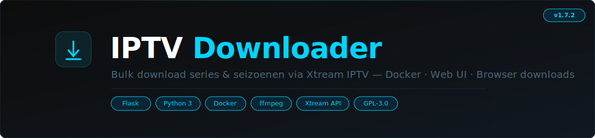

<p align="center">
  
</p>

Een zelfgehoste web-applicatie om series en films van Xtream IPTV providers te downloaden. Selecteer losse afleveringen, een heel seizoen of download films met een klik. Draait als Docker container.

---

## Features

- **Web UI** — toegankelijk via de browser, geen installatie nodig
- **M3U+ URL** — plak je provider URL en je bent klaar
- **Series & Films** — beide volledig ondersteund met eigen navigatie
- **Bulk download** — selecteer meerdere afleveringen of een heel seizoen
- **Browser of server download** — download naar je browser of direct naar een pad op de container
- **Omslagafbeeldingen** — covers voor series en films, lazy loaded
- **Series detailpagina** — hero header met poster, genre, beoordeling, cast en samenvatting
- **Favorieten** — sla series en films op in je watchlist per account
- **Downloadgeschiedenis** — gedownloade afleveringen krijgen een markering
- **Sorteren & filteren** — zoek op naam, sorteer op A-Z of beoordeling
- **Slimme naamgeving** — `Show.Name.S01E03.Episode.Title.mkv` met rename optie
- **Auto-sync** — periodiek nieuwe content ophalen (1u, 6u, 12u, 3 dagen)
- **Accounts opslaan** — meerdere providers opslaan, bewerken en wisselen
- **Auto-connect** — standaard account wordt automatisch verbonden

---

## Snel starten

### Via Portainer (aanbevolen)

1. Ga naar **Stacks > Add stack**
2. Plak de inhoud van [`stack.yml`](stack.yml)
3. Deploy — bereikbaar op poort `2233`

### Via Docker Compose

```bash
git clone https://github.com/RichrdJ/iptv-downloader.git
cd iptv-downloader
docker compose up -d
```

Open vervolgens [http://localhost:2233](http://localhost:2233)

---

## Gebruik

### 1. Verbinden

Plak je M3U+ URL:
```
http://jouw-provider.com/get.php?username=gebruiker&password=wachtwoord&type=m3u_plus
```

Of kies voor **handmatig invoeren** en vul server, gebruikersnaam en wachtwoord apart in.

Vink **Account opslaan** aan om de gegevens te bewaren voor een volgende keer.

### 2. Series & films zoeken

- Blader door de **categorielijst** (apart voor series en films)
- Of gebruik de **zoekbalk** om direct op naam te zoeken
- Gebruik **sorteren en filteren** om snel te vinden wat je zoekt

### 3. Downloaden

**Series:**
1. Klik op een serie om de detailpagina te openen
2. Selecteer losse afleveringen of een heel seizoen via de checkboxes
3. Klik op de downloadknop — pas eventueel de bestandsnaam aan

**Films:**
1. Blader door filmcategorieen of zoek op naam
2. Klik op de downloadknop op een filmkaart
3. Pas eventueel de bestandsnaam aan en bevestig

**Download naar server:**
Ga naar **Instellingen** en kies "Server / container" als download modus. Stel het pad in (bijv. `/mnt/video/_downloads`) en zorg dat dit pad als volume gemount is.

---

## Bestandsnaming

Downloads gebruiken punten als scheidingsteken:

```
Breaking.Bad.S01E01.Pilot.mkv
Breaking.Bad.S01E02.Cats.in.the.Bag.mkv
The.Matrix.1999.mp4
```

Bij elke download kun je de naam aanpassen via het rename dialoog.

---

## Configuratie

| Omgevingsvariabele | Standaard | Omschrijving |
|--------------------|-----------|--------------|
| `CONFIG_DIR` | `/config` | Locatie accounts, cache, favorieten en instellingen |
| `DOWNLOAD_DIR` | `/downloads` | Locatie gedownloade bestanden |
| `SECRET_KEY` | willekeurig | Flask sessie sleutel (stel in voor persistente sessies) |

### Volumes

| Container pad | Omschrijving |
|---------------|--------------|
| `/config` | Accounts, cache, favorieten, geschiedenis, instellingen |
| `/downloads` | Gedownloade bestanden (browser modus) |
| `/mnt/video/_downloads` | Optioneel: server download pad (zelf te configureren) |

---

## Stack YAML

```yaml
services:
  iptv-downloader:
    image: ghcr.io/richrdj/iptv-downloader:latest
    ports:
      - target: 2233
        published: 2233
        mode: host
    volumes:
      - iptv_config:/config
      - iptv_downloads:/downloads
      - /mnt/video/_downloads:/mnt/video/_downloads
    deploy:
      replicas: 1
      restart_policy:
        condition: any

volumes:
  iptv_config:
  iptv_downloads:
```

---

## Techniek

| Component | Keuze |
|-----------|-------|
| Backend | Python 3.12 + Flask |
| IPTV protocol | Xtream Codes API |
| Container | Docker (image via GHCR) |
| UI | Vanilla HTML/CSS/JS |

---

## Licentie

GPL-3.0
