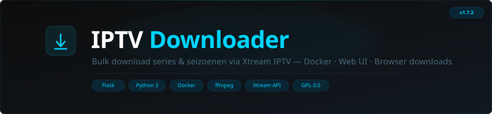

<p align="center">
  
</p>

Een zelfgehoste web-app om series en films van Xtream Codes IPTV-providers te downloaden. Selecteer losse afleveringen, een heel seizoen of een hele serie, en laat de server ze op de achtergrond binnenhalen. Draait als Docker-container (amd64 en arm64).

---

## Features

- **Downloadwachtrij op de server** — voortgang, snelheid en resterende tijd; instelbaar aantal gelijktijdige downloads
- **Hervatten & opnieuw proberen** — onderbroken downloads gaan verder waar ze waren; tijdelijke fouten worden automatisch opnieuw geprobeerd
- **Geen halve bestanden** — er wordt naar `.part` geschreven en pas hernoemd als het bestand compleet is
- **Wachtrij overleeft herstarts** van de container
- **Plex / Jellyfin-mapstructuur** — afleveringen in `Serienaam/Season 01/`, films optioneel in `Titel (Jaar)/`
- **Nette namen** — provider-labels zoals `|NL|`, `[NL]` of `NL:` worden vooraan titels weggehaald
- **Browserdownload** als alternatief, met ondersteuning voor hervatten
- **Series & films** met covers, detailpagina, genre, beoordeling, cast en samenvatting
- **Recent toegevoegd**, categorieën met aantallen en één zoekbalk voor series én films (sneltoets `/`)
- **Slim selecteren** — heel seizoen, alles, alleen niet-gedownloade afleveringen, of een reeks met Shift+klik
- **Favorieten** en **downloadgeschiedenis** per account
- **Auto-sync** — periodiek nieuwe content ophalen (1 uur t/m 3 dagen)
- **Meerdere accounts** opslaan, bewerken en wisselen; het standaardaccount verbindt automatisch
- **Abonnementsinfo** — vervaldatum en maximaal aantal verbindingen
- **Optionele wachtwoordbeveiliging** van de web-UI

---

## Snel starten

### Via Portainer

1. Ga naar **Stacks → Add stack**
2. Plak de inhoud van [`stack.yml`](stack.yml) en pas het bind-pad aan naar je eigen mediamap
3. Deploy — bereikbaar op poort `2233`

### Via Docker Compose

```bash
git clone https://github.com/RichrdJ/iptv-downloader.git
cd iptv-downloader
docker compose up -d
```

Open daarna <http://localhost:2233>.

---

## Gebruik

1. **Verbinden** — plak je M3U+ URL (`http://provider.com/get.php?username=…&password=…&type=m3u_plus`) of vul server, gebruikersnaam en wachtwoord handmatig in.
2. **Zoeken** — blader door categorieën of gebruik de zoekbalk bovenin.
3. **Downloaden** — klik op ↓ bij een aflevering of film, of selecteer meerdere afleveringen en gebruik de balk onderin.

### Server- of browsermodus

In **Instellingen** kies je waar downloads naartoe gaan:

| Modus | Wat gebeurt er | Geschikt voor |
|---|---|---|
| **Server** (aanbevolen) | Wachtrij in de container, schrijft naar `/downloads` | Hele seizoenen, NAS, Plex/Jellyfin |
| **Browser** | Bestand komt via je browser binnen | Losse afleveringen op je eigen apparaat |

> **Let op:** de meeste providers staan maar 1–2 verbindingen tegelijk toe. Zet *Gelijktijdige downloads* niet hoger dan je abonnement toestaat (dit staat in Instellingen → Status). Een stream kijken terwijl je downloadt telt ook als verbinding.

---

## Bestandsnamen

```
Breaking.Bad.S01E01.Pilot.mkv
Breaking.Bad.S01E02.Cats.in.the.Bag.mkv
The.Matrix.1999.mkv
```

Bij elke download kun je de naam aanpassen. Labels van de provider zoals `|NL|`, `[NL]`, `NL:` of `|NL-HD|` worden automatisch weggehaald.

Serverdownloads komen zo op schijf:

```
/downloads/Breaking Bad/Season 01/Breaking.Bad.S01E01.Pilot.mkv
/downloads/Breaking Bad/Season 02/Breaking.Bad.S02E01.Seven.Thirty.Seven.mkv
/downloads/The.Matrix.1999.mkv        (of: The Matrix (1999)/The.Matrix.1999.mkv)
```

---

## Configuratie

| Omgevingsvariabele | Standaard | Omschrijving |
|---|---|---|
| `APP_PASSWORD` | *(leeg)* | Wachtwoord voor de web-UI. **Aanbevolen** als de app buiten je LAN bereikbaar is |
| `CONFIG_DIR` | `/config` | Accounts, cache, favorieten, geschiedenis, wachtrij en instellingen |
| `DOWNLOAD_DIR` | `/downloads` | Hoofdmap voor serverdownloads |
| `SECRET_KEY` | *(automatisch)* | Sessiesleutel. Wordt anders één keer gegenereerd en in `/config` bewaard |
| `VERIFY_SSL` | `false` | SSL-certificaten van de provider controleren (veel providers hebben er geen geldig) |
| `THREADS` | `16` | Aantal webserver-threads (elke browserdownload bezet er één) |
| `PORT` | `2233` | Poort in de container |
| `LOG_LEVEL` | `INFO` | `DEBUG`, `INFO`, `WARNING` |
| `TZ` | `UTC` | Tijdzone, bijv. `Europe/Amsterdam` |

### Volumes

| Container-pad | Omschrijving |
|---|---|
| `/config` | Alle app-data (bevat je provider-wachtwoorden — zet er geen publieke share op) |
| `/downloads` | Serverdownloads. Bind-mount naar je NAS of mediamap |

In Instellingen kun je nog een **submap** binnen `/downloads` kiezen. Het pad moet binnen `/downloads` blijven, want alles daarbuiten staat niet op een volume en is weg na een update.

---

## Upgraden van v2

Alles wordt automatisch gemigreerd: accounts, favorieten, geschiedenis en instellingen blijven behouden.

Eén ding moet je zelf aanpassen: de oude instelling *Download pad* (bijv. `/mnt/video/_downloads`) bestaat niet meer. Serverdownloads gaan nu altijd naar `DOWNLOAD_DIR` (standaard `/downloads`), eventueel met een submap. Stonden je downloads eerder op een pad dat niet gemount was, dan kwamen ze in de container terecht. Controleer daarom je bind-mount in `stack.yml`.

---

## Techniek

| Component | Keuze |
|---|---|
| Backend | Python 3.12, Flask, Gunicorn |
| IPTV-protocol | Xtream Codes API |
| Container | Docker, multi-arch image via GHCR |
| UI | Vanilla HTML/CSS/JS, geen build-stap |

```
app.py              routes
iptv/xtream.py      Xtream API-client
iptv/downloads.py   downloadwachtrij (hervatten, retries, persistentie)
iptv/storage.py     opslag in /config (atomische writes, cache)
templates/          Jinja-templates
static/             app.css, app.js
```

---

## Licentie

GPL-3.0
